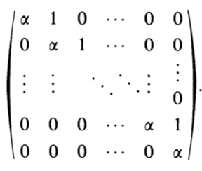
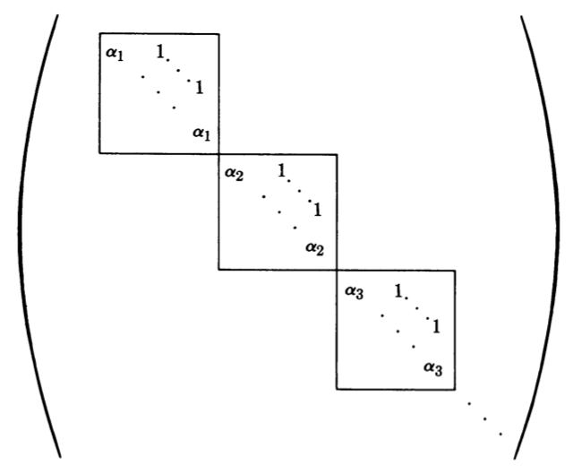

**Subspace**: $W \subseteq V$ where $\quad \quad w_1, w_2 \in W \implies w_1 + w_2 \in W \quad \quad w_1 \in W, a \in K \implies aw_1 \in W$

$\{v_1, \ldots, v_n\}$ is linearly independent $\iff$ $v_i \notin \Span(\{v_1, \ldots, v_n\} \setminus \{v_i\})$

**Basis**: $\{v_1, \ldots, v_n\}$ spans $V$ and is linearly independent

For a basis, each $v \in V$ is unique with respect to the basis

- Span $\implies$ all $v \in V$ is a linear combination of the basis

- Linear Independence $\implies$ if $v = a_1 + v_1 + \cdots + a_n v_n = b_1 + v_1 + \cdots + b_n v_n$, then $0 = (a_i - b_i) w_i \implies a_i = b_i$

- $n$ spanning vectors $\implies$ it is a basis $\quad \quad n$ linearly independent vectors $\implies$ it is a basis

**1.2.6**: Show that $\{t, 1/t\}$ is linearly independent

- Suppose $at + b/t = 0 \quad \quad t = 1 \implies a = -b \quad \quad t = 2 \implies a = b = 0$

**Direct Sum**: For any subspace $W \subseteq V$, there exists a subspace $U$ such that $V = W \oplus U$

- Span: $v = a_1w_1 + \cdots a_k w_k + b_1 u_1 + \cdots + b_r u_r$

- Linear Independence: $v = a_1 w_1 + \cdots + a_k w_k = b_1 u_1 + \cdots + b_ru_r \implies a_i = b_j = 0$

**Onto**: $\Img(F) = R \quad \quad$ **1-1**: $F(d) = F(e) \implies d = e$

**Linear Transformation** $T: V \rightarrow W$: $\quad \quad T(v_1 + v_2) = T(v_1) + T(v_2) \quad \quad T(cv) = cT(v)$

- $T(0_V) = O_W \quad \quad T(a_1v_1 + \cdots a_n v_n) = a_1T(v_1) + \cdots + a_n T(v_n)$

- $\Img(T) \subseteq W \quad \quad w_1 + w_1 = T(v_1) + T(v_2) = T(v_1 + v_2) \in \Img(T) \quad \quad cw = cT(w) = T(cw) \in \Img(T)$

**Pullback**: $T(v_1) = w_1, \ldots, T(v_m) = w_m$

- If $\{w_1, \ldots, w_m\}$ is linearly independent, then $\{v_1, \ldots, v_m\}$ is linearly independent $\quad \quad \dim(\Img(T)) \leq n$

- If $\Ker(F) = 0$ and $\{v_1, \ldots, v_n\}$ is linearly independent, then $\{F(v_1), \ldots, F(v_n)\}$ is linearly independent

$V = \Ker(T) \oplus S$, the pull back of basis of $W$

- Take $v \in V$ and $s \in S$, then $T(v-s) = 0 \implies v - s \in \Ker(T) \implies v = (v - s) + s \implies V = \Ker(T) + S$

- Take $v \in \Ker(T) \cap S \implies v = a_1 v_1 + \cdots + a_m v_m \implies T(v) = 0 \implies a_i = 0 \implies v = 0 \implies \Ker(T) \cap S = \{0\}$

$\dim(V) = \dim(\Ker(T)) + \dim(\Img(T))$

- $\dim(\Img(T)) < \dim(W) \implies$ NOT onto $\quad \quad \dim(\Ker(T)) > 0 \implies$ NOT 1-1

**Isomorphism**: Linear Transformation and a Bijection

- $T^{-1}$ is an isomorphism: $T(v_1) = w_1$ and $T(v_2) = w_2 \implies T(v_1 + v_2) = w_1 + w_2 \implies T^{-1}(w_1 + w_2) = v_1 + v_2$

**Matrix Linear Mapping**: $L_A: R^n \rightarrow R^m$ defined by an $m \times n$ matrix

- WRT to standard basis, $A = [T(E_1), \ldots, T(E_n)]$

- WRT to any basis $B = \{v_1, \ldots, v_n\}$, $M^B_{B'}(T) = [T(v_1), \ldots, T(v_n)]$ with respect to basis $B'$

- Function composition is matrix multiplication $\quad \quad$ Rotation defined by $\begin{bmatrix} \cos \phi & - \sin \phi \\ \sin \phi & \cos \phi\end{bmatrix}$

**Scalar Product**: $\langle v, w \rangle = \langle w, v \rangle \quad \quad \langle v, w_1 + w_2 \rangle = \langle v, w_1 \rangle + \langle v, w_2 \rangle \quad \quad \langle v, cw \rangle = c \langle v, w \rangle$

**Positive definite**: $\forall v, \langle v, v \rangle \geq 0 \quad \quad$ **Non-degenerate**: $\forall v, \exists w, \langle v, w \rangle \neq 0 \quad \quad$ **Non-trivial**: $\exists v, w, \langle v, w \rangle \neq 0$

**Trivial**: $\forall v, w, \langle v, w \rangle = 0 \quad \quad$ Any trivial scalar product means that any basis is orthogonal

**Lemma**: $\langle v, v \rangle = 0 \implies$ scalar product is trivial $\quad \quad \langle v +w, v + w \rangle = \langle v, v \rangle + 2 \langle v, w \rangle + \langle w, w \rangle \implies \langle v, w \rangle = 0$

- **Corollary** $\forall v, \langle v, v \rangle 0 \implies$ has a orthogonal basis

**Theorem**: For any scalar product, $V$ has a orthogonal basis

- Proof by induction. If $\forall v, \langle v, v \rangle = 0 \implies$ orthogonal by Lemma

- Otherwise, let $V_1 = \Span(\{v_1\})$ and show that $V = V_1 \oplus V_1^\perp$ and apply IH to the latter

  - For any $v, \proj_{V_1}v \in V_1$ and $v - \proj_{V_1}v \in V_1^\perp \implies v = \proj_{V_1}v + v - \proj_{V_1}v \implies V = V_1 + V_1^\perp$

  - For $v \in V_1 \cap V_1^\perp$, $\langle v, v \rangle = 0$ and $v = dv_1 \implies d^2 \langle v_1, v_1 \rangle = 0$ and since $\langle v_1, \rangle \neq 0 \implies d = 0 \implies v = 0$

**Orthogonal**: $\langle v, w \rangle = 0 \implies v \perp w \quad \quad$ **Orthogonal Complement**: $W^\perp = \{v \in V \mid \forall w \in W, v \perp w\}$

**Length**: $\|v\| = \sqrt{\langle v, v \rangle} \quad \quad$ **Projection**: $\proj_wv = \frac{\langle v, w \rangle}{\langle w, w\rangle} w \quad \quad \langle v - cw, w \rangle = 0$

**Theorem**: $\{w_1, \ldots, w_r\}$ is pairwise orthogonal $\implies$ it is linearly independent

$\proj_W v \in W \quad \quad (v - \proj_W v) \in W^\perp$

**Gram-Schmidt**: $u_1 = \frac{1}{\|v_1\|}v_1 \quad \quad p_2 = v_2 - \proj_{u_1} v_2 \implies u_2 = \frac{1}{\|p_2\|}u_2$

- **Upshot**: Any Vector Space of $R$ with positive definite scalar product has a orthonormal basis

**Theorem**: For a subspace $W \subseteq V$, $V = W \oplus W^\perp$

- Set $w = \proj_W v \in W$ and $v - w \in W^\perp \implies v = (w) + (v - w) \implies V = W + W^\perp$

- For $w \in W \cap W^\perp$, $\langle w, w \rangle = 0 \implies w = 0$ since positive definite

- **Corollary**: $\dim(V) = \dim(W) + \dim(W^\perp)$

**5.2.7.a**: Let $V$ be the vector space of all $n \times n$ matrices over $R$, show that $\langle A, B \rangle = \Tr(AB)$ is non-degenerate

- If $\langle A, B \rangle = 0$ for all $B \in V$, then we can choose $B_{ij}$ with $0$ in all components except $ij$ coordinate to show that $A = O$

**5.2.7.c**: Let $V$ be the space of real $n \times n$ symmetric matrices. What is the dimension of $W$, subspace consisting of matrices with $\Tr(A) = 0$? What is the dimension of $W^\perp$?

- $\dim(W) = \frac{n(n+1)}{2} - 1$ since one of the diagonal entries will be a LC of the other diagonal entries. Thus $\dim(W^\perp) = 1$

**Rank**: $\dim(R_A) = \dim(C_A)$. For a linear mapping $L_A$ defined by matrix $A$

- $\Img(L_A) = C_A, \Ker(L_A) = \Null(A) \implies \dim(R^n) = \dim(\Img(L_A)) + \dim(\Ker(L_A)) = \dim(C_A) + \dim(\Null(A))$

- For $v \in \Null(A), A_i \perp v \iff v \in (R_A)^\perp \implies \dim(R^n) = \dim(R_A) + \dim((R_A)^\perp) = \dim(R_A) + \dim(\Null(A))$

- Solution space for homogenous equation is $n - \rank(A)$

**5.3.6**: Find dimension of solution set of $X \cdot A = P \cdot A$ for vector $A$ and point $P$

- We have $(X - P) \cdot A = 0 \implies \dim(A^\perp) = n - 1$

**Hermitian Inner Product**: $\langle v, w \rangle = \overline{\langle w, v \rangle} \quad \quad \langle v, w_1 + w_2 \rangle = \langle v, w_1 \rangle + \langle v, w_2 \rangle \quad \quad \langle cv, w \rangle = c \langle v, w \rangle \quad \quad \langle v, cw \rangle = \overline{c} \langle v, w \rangle$

- **Note**: Hermitian Inner Product is positive definite

**Dual Space**: $V^* = L(V, k) \quad \quad \phi:V \rightarrow K \in V^* \quad \quad$ Most basic operation: $\phi_i(v_j) = \begin{cases} 1 & i = j \\ 0 & i \neq j \end{cases}$

**Theorem**: $B' = \{\phi_1, \ldots, \phi_n\}$ is a basis for $V^*$

- Linear Independence: $0 = a_1 \phi_1 + \cdots a_n \phi_n \implies 0 v_i = 0 \implies a_i \phi_i = 0 \implies a_i = 0$

- Spanning: Take $T \in L(V, K)$ where $T(v_i) = b_i$ and take $\phi^* = b_1 \phi_1 + \cdots + b_n \phi_n \in \Span(B')$

  Now show that $T = \phi^*$ by applying $Tv_i = \phi^* v_i = b_i \implies T \in \Span(B')$

- **Corollary**: $V^* \approx V \implies \dim(V^*) = \dim(V)$

- **Corollary**: There exists a 1-1, onto linear function $F: V \rightarrow V^*$ such that $F(v_i) = \phi_i$

**5.6.5**: For $\phi, \psi$ non-zero functionals that are not scalar multiples of each other, show that dimension of $\Ker(\psi) \cap \Ker(\phi) = n - 2$

- $v \in \Ker(\psi) \cup \Ker(\phi)$ otherwise $v \notin \Ker(\psi)$ and $v \notin \Ker(\phi) \implies \psi = c \phi$. Contradiction

  Thus $\dim(\Ker(\psi) \cup \Ker(\phi)) =n = (n - 1) +  (n-1) - \dim(\Ker(\phi) \cap \Ker(\psi)) \implies \dim(\Ker(\phi) \cap \Ker(\psi)) = n - 2$

**5.6.6**: Show that $v \in V$ gives rise an element $\lambda_v \in V^{**}$ and that $v \rightarrow \lambda_v$ gives an isomorphism $V \approx V^{**}$

- $\lambda_v = \phi(v)$ for some $\phi \in V^*$

  For 1-1, take $v \in \Ker(F) \implies \lambda_v = 0 \implies \forall \phi \in V^*, \phi(v) = 0$. BWOC, suppose $v \neq 0 \implies \exists \phi$ such that $\phi(v) \neq 0$

  Since $\dim(V) \approx \dim(V^*) \approx \dim(V^{**}) \implies F$ is onto and thus a bijection

  To show that $F$ is an isomorphism, $F(aw + bv) = \lambda_{aw + bv} = \phi(aw + bv) = a\phi(w) + b\phi(v) = a\lambda_w + b \lambda_v$

**5.6.7**: Show that $W^{\perp \perp} = W$ for a non-degenerate scalar product

- $W^{\perp \perp} = \{v \in V \mid v \perp W^{\perp}\}$ so for $w \in W, w \perp W^{\perp} \implies W \subseteq W^\perp$

  Also $V = W \oplus W^\perp = W^\perp \oplus W^{\perp \perp} \implies \dim(W) = \dim(W^{\perp \perp}) \implies W = W^{\perp \perp}$

**Operators**: $T: V \rightarrow V$, associated with an $n \times n$ matrix

**Multilinear k-form**: $V \times \cdots \times V \rightarrow K, \omega(v_1, \ldots, (av_i + bw_i), \ldots, v_k) = a\omega(v_1, \ldots, v_i, \ldots, v_k) + b \omega(v_1, \ldots, w_i, \ldots, v_k)$

- **Upshot**: Linear on each coordinate if the other coordinates are fixed

- $\ML_K(V)$: set of all $\omega: V \times \cdots \times V \rightarrow K$ is a vector space

  - $\ML_1(V) = \{\omega : V \rightarrow K\} = V^* \quad \quad \ML_2(V) = \{\omega \mid V \times V \rightarrow K\} \supseteq$ scalar products

**Alternating**: $\omega: V^K \rightarrow K$ such that $v_i = v_j \implies \omega(v_1, \ldots, v_k) = 0$

- **Example**: Determinate with the same column is equal to $0$

- $\Lambda$: Set of alternating multilinear k forms $\subseteq \ML_K(V)$

**Permutation**: $\sigma : [n] \rightarrow [n] \quad \quad$ **Transposition**: $\tau$ swaps 2 entries of $[n]$ so $\tau = \tau^{-1} \implies \tau^2 = \id$

- $\epsilon = \begin{cases} +1 & \sigma \text{ even } \\ -1 & \sigma \text{ odd }\end{cases} \quad \quad \sigma \in S_k$ permutes $\{x_1, \ldots, x_k\} \rightarrow \{x_{\sigma(1)}, \ldots, x_{\sigma(k)}\}$

- **Notation**: $(\sigma_\omega) = (x_1, \ldots, x_k) = \omega(x_{\sigma(1)}, \ldots, x_{\sigma(k)})$

**Theorem**: For $\omega \in \Lambda(V)$ and $\sigma \in S_k$, $(\sigma_\omega) = \epsilon(\sigma) \omega$

- Look at transposition $\tau$ and let $\overline{\omega}(x, y) = \omega(v_1, \ldots, x, \ldots, y, \ldots, v_k) \implies \overline{\omega}(x + y, x+ y) = 0 \implies \omega(x, y) = - \omega(y, x)$

**Theorem**: $\{v_1, \ldots, v_k\}$ linearly dependent $\implies \forall \omega \in \Lambda(V), \omega(v_1, \ldots, v_k) = 0$

- **Upshot**: Multilinear forms preserve linear dependence

**Big Count**: For a basis $B = \{b_1, \ldots, b_n\}$ and $\omega \in \Lambda(V)$, $\omega(v_1, \ldots, v_n) = \omega(b_1, \ldots, b_n) \sum_{\sigma \in S_n}(a_{1 \sigma(1)}) \cdots a_{n \sigma(n)} \epsilon (\sigma)$

- **Note**: $\dim(\Lambda(V)) = 1$ if $\dim(V) \geq 1$. Otherwise $\dim(\Lambda(V)) = 0$

- $T: V \rightarrow V$, $T^*: \Lambda_n(V) \rightarrow \Lambda_n(V)$, define $T^*(\omega): V^n \rightarrow K$ and $T^*(\omega)(u_1, \ldots, u_n) = \omega(T(u_1), \ldots, T(u_n)) \implies T^*(\omega) = d \omega$

**Properties of $\det(T)$**:

- $T(v) = av \implies T^*(\omega)(u_1, \ldots, u_n) = \omega(T(u_1), \ldots, T(u_n)) = a^n \omega(u_1, \ldots, u_n) \implies \det(T) = a^n$

- $\id \implies \id(v) = v \implies \det(\id) = 1 \quad \quad$ zero $\implies$ zero$(v) = 0 \implies \det($zero$) = 0$

- $(S \circ T)^* \omega(u_1, \ldots, u_n) = \omega(S \circ T(u_1), \ldots, S \circ T(u_n)) = \det(S) \det(T) \omega(u_1, \ldots, u_n)$

- Invertible: $\det(T^{-1}) = \frac{1}{\det(T)} \iff T$ is invertible $\iff \det(T) \neq 0$

The following are equivalent:

1. $T$ is an isomorphism
2. $T$ is invertible
3. $\rank(T) = n$
4. $\det(T) \neq 0$

For $A \in M_{n \times n}(K), \det(A) = \sum_{\sigma \in S_n} \epsilon(\sigma) a_{1 \sigma(1)} \cdots a_{n \sigma(n)} = \epsilon(\id) a_{11}a_{22} + \epsilon(\tau) a_{12} a_{21}$

**6.2.1**: Show that $D(cA) = c^3 D(A)$

- $D(cA) = D(cA^1, cA^2, cA^3) = c^3 D(A)$

**Symmetric Operator**: $\langle Av, w \rangle = \langle v, A^t w \rangle \quad \quad$ **Symmetric** $\iff A = A^t \implies \langle Av, w \rangle = \langle v, Aw \rangle$

- $(A + B)^t = A^t + B^t \quad \quad (AB)^t = B^t A^t \quad \quad (cA)^t = cA^t \quad \quad A^{tt} = A$

**Hermitian Operator**: $\langle Av, w \rangle = \langle v, A^*w \rangle \quad \quad$ **Hermitian** $\iff A^* = \overline{A^t} = A \iff A^t = \overline{A}$

- $(A + B)^* = A^* + B^* \quad \quad (AB)^* = B^* A^* \quad \quad (\alpha A)^* = \overline{\alpha} A^* \quad \quad A^{**} = A$

**Unitary**: $\langle Av , Aw \rangle = \langle v,w \rangle \quad \quad$ **Real Unitary** $\iff A^t A = I \quad \quad$ **Complex Unitary** $\iff A^*A = i \iff \overline{A^t}A = I$

**7.1.1.c**: Show that for a skew-symmetric matrix $A$, $\det(A) = 0$ if $A$ is an $n \times n$ matrix where $n$ is odd

- $\det(A) = \det(A^t) = \det(-A) = (-1)^n \det(A) \implies \det(A) = 0$ when $n$ is odd

**7.1.2**: If $A$ is an invertible symmetric matrix, show that $A^{-1}$ is symmetric

- $AA^{-1} = I \implies (A^{-1})^t A^t = I \implies (A^{-1})^t A = I \implies A^{-1} = (A^{-1})^t$

**7.1.7**: For a non-degenerate $\langle, \rangle$ and linear map $A:V \rightarrow V$, show that the image of $A^{t}$ is the orthogonal space to the kernel of $A$

- Take $y \in \Img(A^{t}) \implies A^{t}x = y$ and take $z \in \Ker(A)$, then $\langle y, z \rangle = \langle Ax, z \rangle = \langle x, Az \rangle = 0$

**7.1.10**: Take positive definite $\langle , \rangle$ over $R$ and suppose that $V = W + W^\perp$. Let $P$ be the projection on $W$. Show that $P$ is symmetric and semipositive ($\langle Av, v \rangle \geq 0$)

- Show symmetric, take $a = a_1 + a_2$ and $b = b_1 + b_2$, then $\langle Pa, b \range = \langle a_1, b_1 \rangle = \langle a, Pb \rangle$

- Show semipositive, take $a = a_1 + a_2$, then $\langle Pa, a \rangle = \langle a_1, a_1 \rangle \geq 0$ since positive definite

**7.3.1.a**: Take a positive definite scalar product over $R$ and let $\{v_1, \ldots, v_n\}$ and $\{w_1, \ldots, w_n\}$ be orthonormal bases. Take $A:V \rightarrow V$ such that $Av_i = w_i$. Show that $A$ is real unitary.

- $\langle v_i, w_j \rangle = \langle v_i, a_1v_1 + \cdots + a_n v_n \rangle = a_i$ and $\langle Av_i, A w_j \rangle = a_i \langle w_i, w_i \rangle = a_i$

**7.3.3**: Show that $A^t$ is unitary, $A^{-1}$ exists and is unitary, if $B$ is real unitary, then $AB$ and $B^{-1}AB$ are unitary

- $\langle A^t v, A^t w \rangle = \langle v, A A^t w \rangle = \langle v, w \rangle$

- $AA^{-1} = AA^t = I \implies A^{-1} = A^t$ is unitary

- $\langle AB v, AB w \rangle = \langle v, B^t A^t A B w \rangle = \langle v, w \rangle$ and $\langle B^{-1} AB v, B^{-1} AB \rangle = \langle v, B^tA^tB B^{-1} AB w \rangle = \langle v, w \rangle$

**Eigenvalue**: $\lambda$ such that $Av = \lambda v$ for some $v \in V \quad \quad$ **Eigenvector**: $v$ such that $Av = \lambda v$ for some $\lambda \in K$

**Theorem**: If $\{v_1, \ldots, v_n\}$ are eigenvectors of distinct $\lambda_1, \ldots, \lambda_m$, then it is linearly independent

- By Induction: $\lambda_1(c_1 v_1 + \cdots + c_m v_m) = 0$ and $A(c_1v_1 + \cdots + c_m v_m) = 0 \implies c_2 (\lambda_2 - \lambda_1) v_2 + \cdots + c_m(\lambda_m - \lambda_1) v_m = 0 \implies c_1 = \cdots = c_m = 0$

**Diagonalization**: Basis $\{v_1, \ldots, v_n\}$ is diagonalizes $L:V \rightarrow V$ if each $v_i$ is an eigenvector such that $Lv_i = c_iv_i$

- Transformation matrix WRT to basis is diagonal with $c_i$

**Characteristic Polynomial**: $P_A(t) = \det(tI - A) \quad \quad \lambda$ is an eigenvalue $\iff P_A(\lambda) = 0$

**Theorem**: $A: V \rightarrow V$ is symmetric, then $A$ has a non-zero eigenvector

**Invariant**: $A(W) \subseteq W \iff \forall u \in W, Au \in W$

**Theorem**: For symmetric $A: V \rightarrow V$ and eigenvector $v$, $w \in V$ and $w \perp v \implies Aw \perp v$

- $\langle Aw, v \rangle = \langle w, Av \rangle = \lambda \langle w,v \rangle = 0 \implies Aw \in W^\perp \implies W^\perp$ is invariant $A$

**Spectral Theorem**: For symmetric $A: V \rightarrow V$, $V$ has an orthonormal basis of eigenvectors

- Since $A$ is symmetric, take an eigenvector $v_1$ and define $V_1 = \Span(\{v_1\})$, then $V = V_1 \oplus V_1^\perp$, both invariant under $A$

  Apply IH to $W^\perp$, with dimension $n - 1$ to create an orthonormal basis $\{e_1, \ldots, e_n\}$ where diagonal matrix of $\lambda_i$ is the matrix WRT to $\{e_1, \ldots, e_n\}$

**Theorem**: For symmetric $A$ matrix, there exists real unitary matrix $U$ such that $U^t AU = U^{-1} AU$ is diagonal

- **Upshot**: All symmetric matrices can be written as $A = U D U^t$ where $D$ is diagonal and $U$ is real unitary

**8.2.10**: Show that eigenvalues of $A, A^t$ are the same

- $\det(tI - A) = \det((tI - A)^t) = \det(tI - A^t)$

**8.2.11**: Let $A$ be invertible matrix, then $\lambda \neq 0$ and $\lambda^{-1}$ is an eigenvalue of $A^{-1}$

- If $\lambda = 0$, then $Av = 0 \implies A$ not invertible since $\Ker(A) \neq \{O\}$

- $A^{-1}A v = A^{-1} \lambda v \implies Iv = A^{-1}v \lambda v \implies A^{-1} v = \lambda^{-1} v$

**8.2.12**: Does the derivative of $\{\sin t, \cos t\}$ have any non-zero eigenvectors?

- $D(a \cos t + b \sin t) = b \cos t - a \sin t = \lambda(a \cos t + b \sin t) \implies (b - a \lambda) \cos t + ( -a - b \lambda ) \sin t = 0 \implies \lambda^2 b + \lambda = 0 \implies$ no

**8.2.15**: Show that eigenvalues of $AB$ are the same as eigenvalues of $BA$

- $ABv = \lambda v \implies B \lambda v = BAB v = (BA) Bv$ so $\lambda$ is an eigenvalue of $AB, BA$

  If $\lambda = 0$, then $P_{AB}(t) = \det(-AB) = \det(-BA) = P_{AB}(t)$

**8.4.3**: For symmetric $A: V \rightarrow V$ show that $\langle A v, v \rangle > 0 \implies \lambda > 0$ and $\exists$ symmetric $B$ such that $B^2 = A$ and $BA = AB$, and what are the eigenvalues of $B$

- $\langle Av, v \rangle = \lambda \langle v, v \rangle \implies \lambda > 0$

- $A = UDU^{t} = (UD'U^{t}) (UD'U^{t}) = B^2$ (symmetric since $B^t = B$) and $(UD'U^t)(UDU^t) = UD'DU^t = (UDU^t)(UD'U^t)$

**8.4.12**: Show that if symmetric $A$ only has one eigenvalue, every orthogonal basis of $V$ consists of eigenvectors of $A$

- $D = U^{-1} A U \implies A = UDU^{-1} = U \lambda I U^{-1} = \lambda I$. Thus any vector is an eigenvector

**8.4.13**: Let $A: V \rightarrow$ be symmetric and that there are $n$ distinct eigenvalues of $A$. Then the eigenvectors form an orthogonal basis of $V$

- Any $v_i, v_j$ are orthogonal since $\langle A v_i, v_j \rangle = \lambda_i \langle v_i, v_j \rangle = \lambda_j \langle v_i, v_j \rangle = \langle v_i, A v_j \rangle \implies (\lambda_i - \lambda_j) \langle v_i, v_j \rangle = 0 \implies v_i \perp v_j$

- Induction: $\lambda_1 (a_1v_1 + \cdots + a_n v_n) = A(a_1v_1 + \cdots + a_n v_n) \implies (\lambda_1 - \lambda_2) a_2 v_2 + \cdots = 0 \implies a_i = 0$. Thus linearly independent

**Polynomial**: $f(t) = a_n t^n + \cdots + a_0 \quad \quad \deg(fg) = \deg(f) + \deg(g) \quad \quad$ **Root** $\alpha \implies f(\alpha) = 0$

- For complex polynomial, $\exists \alpha_1, \ldots, \alpha_n$ such that $f(t) = (t - \alpha_1) \cdots (t - \alpha_n)$

For $n \times n$ matrix $A$, exists a polynomial $f \in K[t]$ such that $f(A) = 0$. Follows from owers of $A$ are linearly dependent for $N > n^2$
$$a_NA^n + \cdots + a_0 I = 0 \implies f(t) = a_Nt^N + \cdots + a_0$$
- **Note**: this also applies to linear maps $A$

**9.2.2**: If $A$ is a symmetric matrix, show that $f(A)$ is also symmetric

- Clearly symmetry holds over $+$ and scalar multiplication. For $A^n$, use induction: $(A^{k+1})^t = A^t (A^k)^t = A^{k+1}$

**Fan**: A **fan** of operator $A$ is sequence of subspace $\{V_1, \ldots, V_n\}$ such that $V_i \subset V_{i + 1}$ where each $V_i$ is $A$-invariant

**Fan Basis**: $\{v_1, \ldots, v_n\}$ such that $\{v_1, \ldots, v_i\}$ is a basis for $V_i$

**Theorem**: If $\{v_1, \ldots, v_n\}$ is a fan basis for $A$, the matrix associated with $A$ is upper triangular

- Since $AV_i \subset V_i, \exists a_{ij}$ such that $Av_i = a_{1i}v_1 + \cdots + a_{ii} v_n$, which creates an upper triangular matrix

- **Note**: Converse holds since an upper triangular matrix $A$ has column unit vectors that form a fan basis for $A$

**Trianglular**: Operator $A:V \rightarrow V$ has a basis with an associated matrix of $A$ that is **triangular**

**10.1.4**: Show that the inverse of an invertible triangular matrix is also triangular, having the same fan as $A$, $\{V_1, \ldots, V_n\}$

- $A:V_i \rightarrow V_i \implies A^{-1}: V_i \rightarrow V_i$ so $V_i$ is $A^{-1}$ invariant. Also each $V_i \subset V_{i+1}$

**Theorem**: For $V$ over the complex, fan of $A$ exists

For char polynomial $P(A) = (A - \lambda_1 I) v_1 \cdots (A- \lambda_n I) v_i = 0 \implies P(A) = 0$ for vectors of a basis of eigenvectors $\{v_1, \ldots, v_n\}$

**Theorem**: Let $V$ be a complex vector space and $A: V \rightarrow V$, let $P$ be the char polynomila, then $P(A) = 0$

- **Corollary**: For a $n \times n$ matrix of complex numbers $A$, $P(A) = 0$

**Euclidean Algorithm**: $f(t) = q(t) g(t) = r(t)$ where $\deg(r) < \deg(g)$

- **Corollary**: $f(\alpha) = 0 \implies f(t) = (t - \alpha) q(t)$

**Ideal**: $J \subseteq K[t]$ satisfying: $0 \in J \quad \quad f, g \in J \implies f+ g \in J \quad \quad f \in J \implies \forall g \in K[t], gf \in J$

- $1$ is the **generator** of $K[t]$, also $1$ is called the **unit ideal**

**Theorem**: For an ideal $J$, there exists a generator $g$ where $g$ is the smallest degree

**Greatest Common Divisor**: $g = \gcd(f_1, f_2) \implies g \mid f_1, g \mid f_2$ and $h \mid f_1$ and $h \mid f_2 \implies h \mid g$

**Theorem** If $g$ is the generator of the ideal created by $f_1, f_2$, then $\gcd(f_1, f_2) = g$

- **Corollary**: Can be generalized to $n$ polynomials $f_1, \ldots, f_n$

**Relatively Prime**: $\gcd(f_1, \ldots, f_n) = 1 \quad \quad$ **Irreducible** if $p = fg \implies f$ or $g$ has degree $0$

**Theorem**: Every $f \in K[t]$ can be expressed as a product of irreducibles $p_i$

**Multiplicity**: $f = p^m g \implies m$ is the mulitplicity of $p$ in $f$

Take $f(t) \in K[t]$ and $w = W = \Ker(f(A))$, then $W$ is invariant under $A$

- For $v \in W$, we have $tf(t) = f(t)t \implies Af(A)v = f(A)Av = 0 \implies Av \in W$

**Note**: $f(A) g(A) = g(A) f(A)$

**Theorem**: For $f \in K[t]$ where $f = f_1 f_2$ where $f_1, f_2$ have degree $\geq$ and $\gcd = 1$, $f(A) = 0$, and $W_1 = \Ker(f_1(A)), W_2 = \Ker(f_2(A))$, we have that $V = W_1 + W_2$

- $g_1(A) f_1(A)v + g_2(A) f_2(A)v = v \implies V = W_2 + W_1$ since left component in $W_2$ and right component in $W_1$

- Set $v = w_1 + w_2 \implies g_1f_1 v = g_1f_1 w_2 \implies w_2 = g_1f_1 v$. Similar for $w_1 = g_2f_2 v$. This comes from $g_1f_1 w_2 + g_2 f_2 w_2 = w_2$

- **Corollary**: Theorem also applies for several product of factors

**Theorem**: Vector Space over $C$ and an $A: V \rightarrow A$ such that $P(A) = 0$ where $P(t) = (t - \alpha_1)^{m_1} \cdots (t - \alpha_r)^{m_r}$. Set $W_i = \Ker(A - \alpha_iI)^{m_i}$, then $V = \oplus W_1 \oplus \cdots \oplus W_r$

**11.4.1**: Show that $\Img(f_1(A)) = \Ker(f_2(A))$

- $y \in \Img(f_1(A)) \implies f_1(A) x = y \implies f_2(A) y = 0 \implies \Img(f_1(A)) \subseteq \Ker(f_2(A))$

- $v \in \Ker(f_2(A)) \implies v = g_1f_1 v + g_2 f_2 v = g_1 f_1 v \in \Img(f_1(A))$

**11.4.3**: Show that if $P_A(t) = (t - \alpha_1) \cdots (t - \alpha_n)$ that $V$ has a basis consisting of eigenvectors of $A$

- $P(A) = 0$ and $P = \prod f_i$ where $f_i(t) = (t - \alpha_i)$

  Set $V_i = \Ker(f_i(A))$, then $V_i$ is an eigenspace of $A$ and $V = V_1 \oplus \cdots \oplus V_n$ and $V$ has a basis of eigenvectors

**S-invariant**: $BW \subseteq W$ for all operators $B \in S \quad \quad$ **Simple S-space**: Only S-invariant subspaces of $V$ are $V, O$

**Example 1**: $A$ such that $AB = BA$ for all $B \in S \implies \Img(A), \Ker(A)$ are S-invariant

- $w = Av \implies Bw = BAv = ABv \implies Bw \in \Img(A) \quad \quad u \in \Ker(A) \implies ABu = BAu = 0 \implies Bu \in \Ker(A)$

**Theorem**: For a simple S-space $V$ and operator $A: V \rightarrow V$ such that $AB = BA$ for all $B \in S$, either $A$ is invertible or $A$ is zero map

- Assume $A \neq 0$, by example 1, $\Ker(A) = \{O\}$ and its image is all of $V \implies A$ is invertible

**Theorem**: For a vector space $V$ over $C$, a set of operators $S$, $V$ is S-simple, operator $A: V \rightarrow V$ such that $AB = bA$, there exists $\lambda$ such that $A = \lambda I$

- Take the ideal $J$ such that $f(A) = 0$ and take its generator $g$. $g$ is irreducible since otherwise $g = h_1 h_2 \implies h_1(A) \neq 0, h_2(A) \neq 0$ are invertible $\implies g= h_1 h_2$ is invertible but $\deg(g) > 0$

  Any irreducible over $C$ has degree $1$ thus $g(t) = t - \lambda \implies g(A) = 9 \implies A = \lambda I$

**Cyclic**: $(A - \lambda I)$ is cyclic if $(A - \lambda I)^r v = O \quad \quad$ **Period** is $r$ such that $(A - \alpha I)^k v \neq 0$ for $0 \leq k < r$

**Lemma**: $\{v, (A - \alpha I)v, \ldots, (A - \alpha I)^{r-1} v\}$ is linearly independent

- Let $B = A - \alpha I$ and $f(t) = c_0 + \cdots + c_s t^s$ for $s \leq r - 1$, then $f(B)v = 0$

  Take $g = t^r$ and let $h = \gcd(f, g) \implies h = f_1 f + g_1 g \implies h(B)v = 0$

  Then $h \mid g \implies h = t^d$ for $d \leq r - 1$. Contradiction since $r$ is the period

A vector space is **cyclic** if $\{v, Av, \ldots, A^{r-1}v\}$ generates $V$

- **Corollary**: By the previous lemma, $\{(A - \alpha I)^{r-1}v, \ldots, v\}$ is a basis for $V$

**Jordon Basis** for $V$ with respect to $A$

{ height=100px}

- **Note**: $(A - \alpha I)^{r-1}v$ is an eigenvector with eigven value $\alpha$

If $V$ is the direct sum of A-invariant subspaces, $V = V_1 \oplus \cdots \oplus V_m$ and each $V_i$ is cyclic, the then the sequence of Jordan basis for each $V_i$ form a basis for $V$

**Jordan Normal Form**:

{ height=150px}

**Theorem**: For $V$ over $C$ and operator $A: V \rightarrow V$, $V$ can be expressed as a direct sum of A-invariant cyclic subspace
